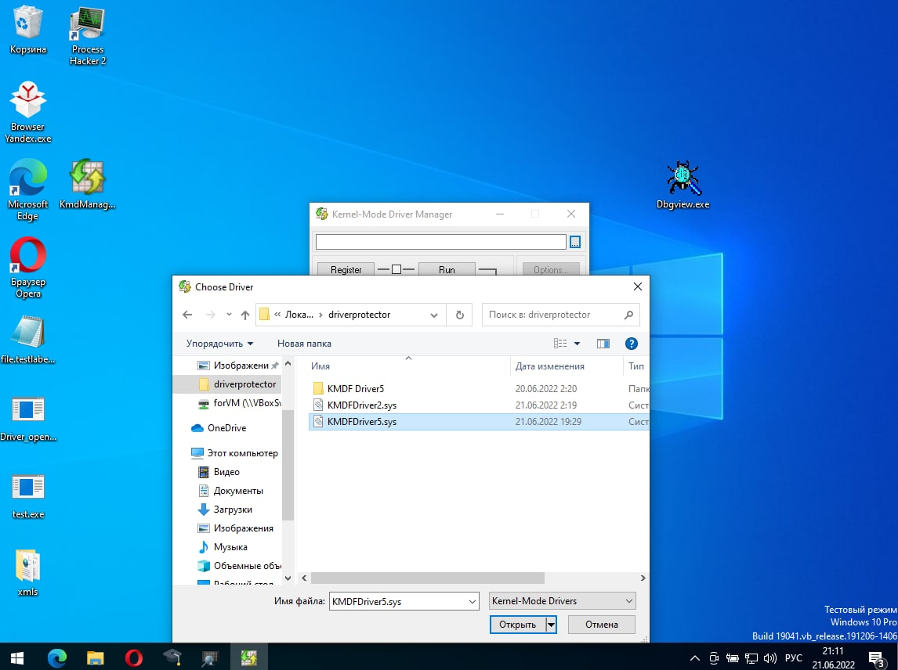
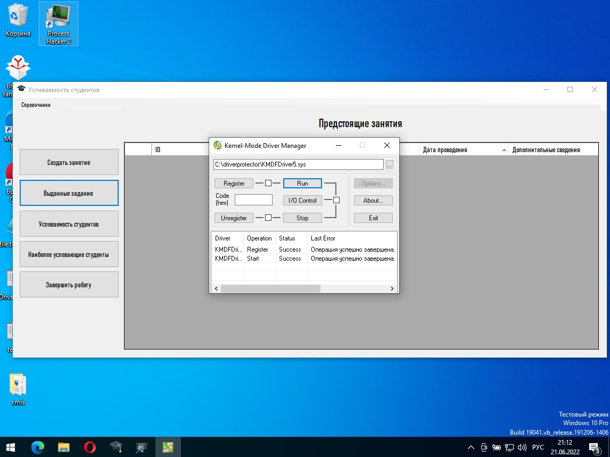
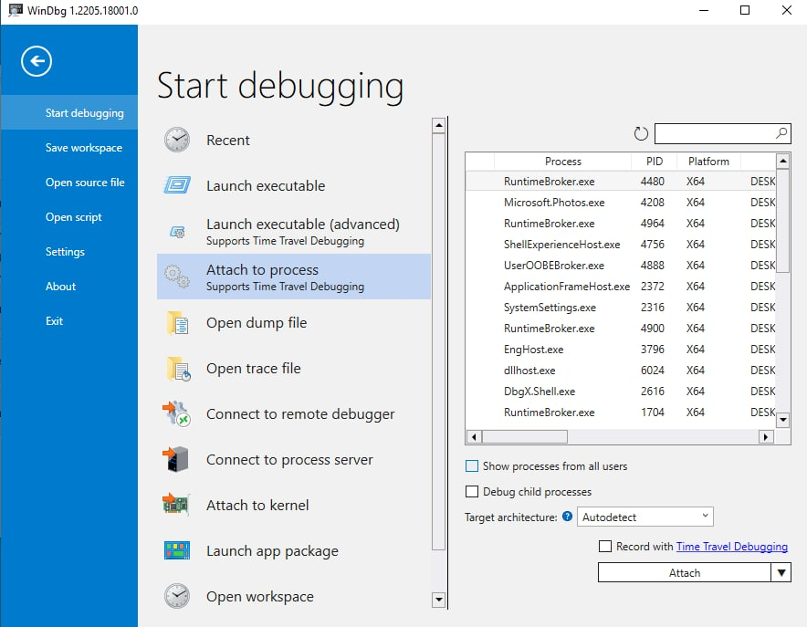
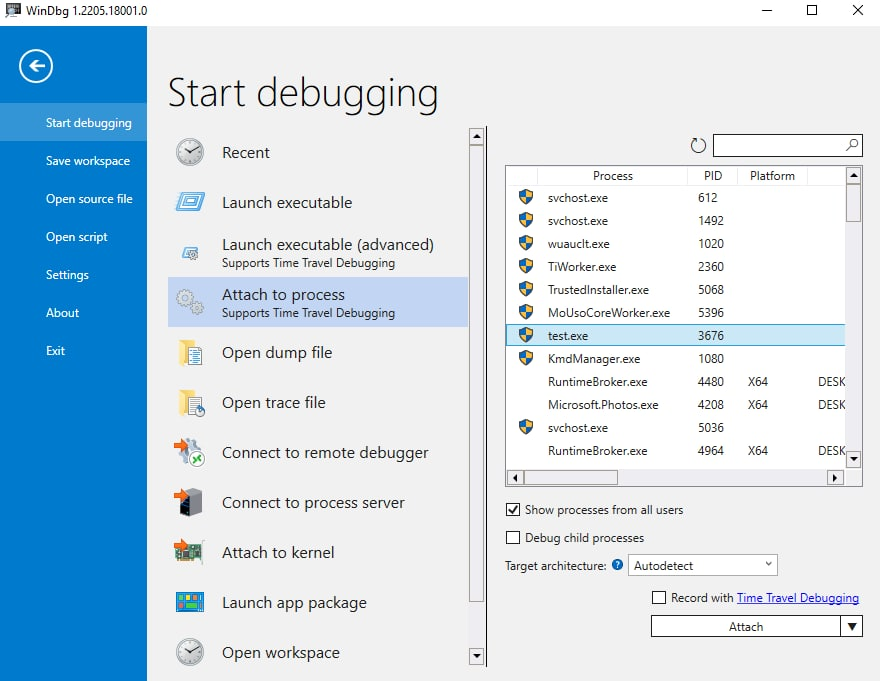
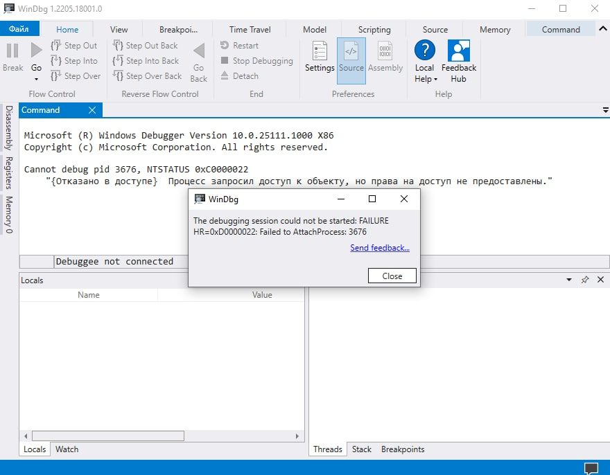

# Protection from attaching a user-level debugger using a kernel-level driver

## 1.Begin

Собираем проект в Microsoft Visual Studio(запуск Visual Studio от администратора, иначе могут возникнуть ошибки при сборке)

## 2.Exploitation

1.Запускаем test.exe

2.Запускаем от имени администратора KmdManager.exe

3.Указываем путь к .sys файлу, собранному в Microsoft Visual Studio(x64-->debug-->"projectName"-->"projectName".sys

4.Клацаем на "Register", затем на "Run". После данных действий наш драйвер активирован.

5.Открываем WinDbg Preview и видим, что нашего процесса нет в списке.

6.Для того, чтобы отобразить его, ставим галочку на "Show processes from all users". После мы увидим наш запущенный процесс. Для запуска процесса потребуются права Администратора.

7.Подключаемся к нашему процессу и видим ошибку!

## 3.References

Статья с объяснениями как работают процессы и какие функцию отлавливают и ограничивают права к процессам:https://link.springer.com/chapter/10.1007/978-3-030-52683-2_4#Sec5  
Github с кодом драйвера из статьи выше:https://github.com/Anonymous-3ab41c/FastAndFurious/blob/master/ProtectionDriver.c 
Видео про работу античитов и их обход:https://youtu.be/_F_6VBAhsy0?t=103 
Виды прав безопасности:https://docs.microsoft.com/ru-ru/windows/win32/procthread/process-security-and-access-rights?redirectedfrom=MSDN 
ObRegistersCallback:https://docs.microsoft.com/en-us/windows-hardware/drivers/ddi/wdm/nf-wdm-obregistercallbacks 
Снятие хуков защиты:https://blog.xpnsec.com/anti-debug-openprocess/ 